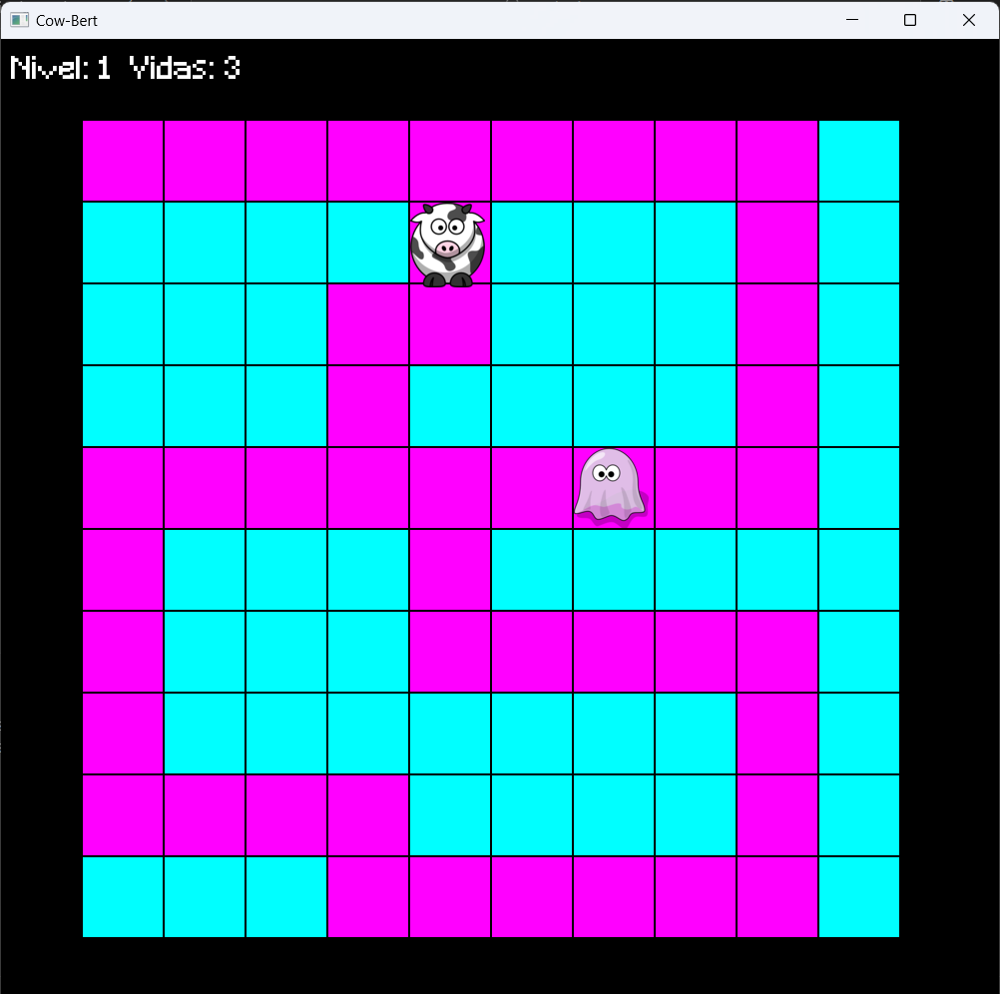
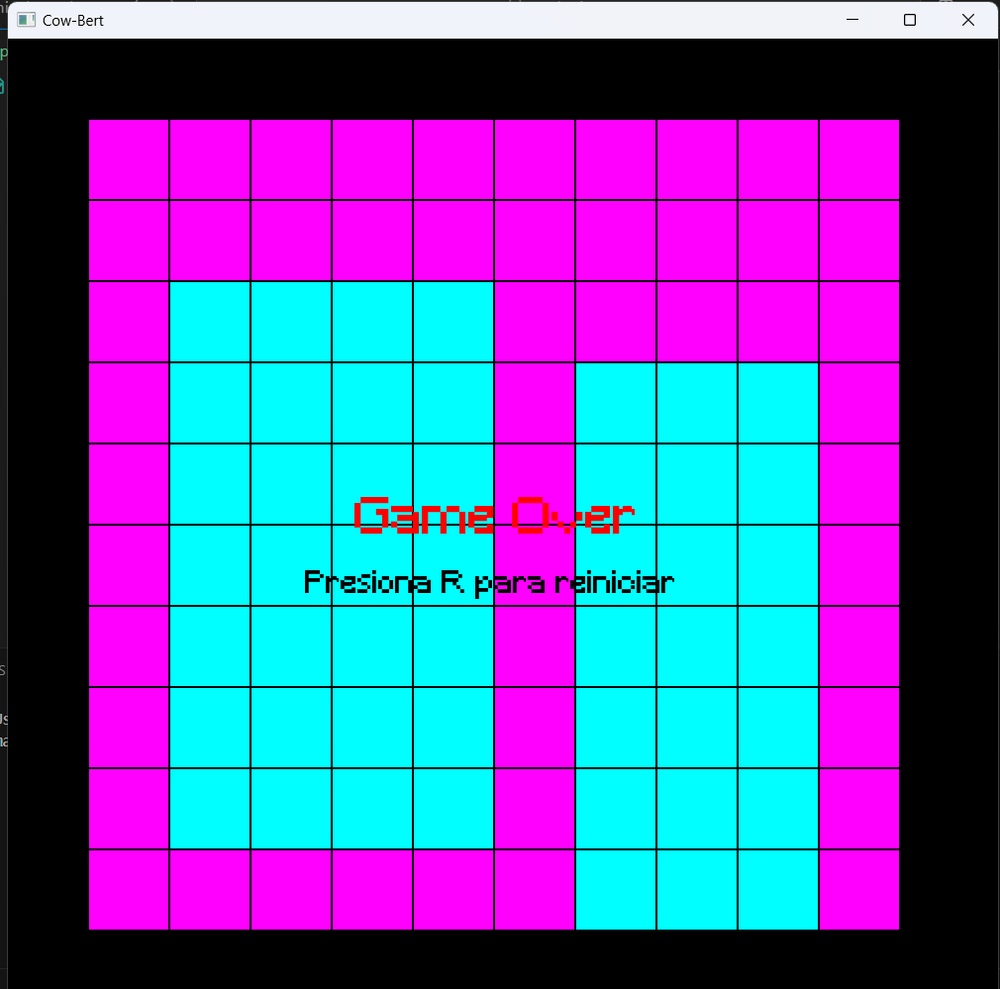
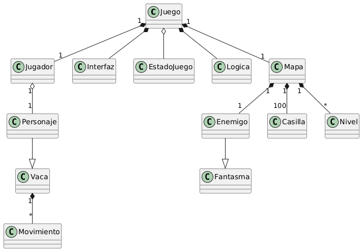

# Cow-Bert
Cow-Bert es una emocionante reimaginación del clásico juego arcade "Q-bert", programado en C y potenciando sus gráficos y dinámica con la biblioteca SFML. En Cow-Bert, los jugadores se sumergen en un vibrante mundo de píxeles donde deben guiar a nuestro protagonista a través de un desafiante mapa de baldosas. Cada movimiento cuenta, ya que un paso en falso puede llevar a una pérdida de vida y la necesidad de empezar de nuevo.

## Manual de Usuario
Para jugar es muy sencillo, utiliza las teclas WASD para moverte por el mapa, ¡PERO CUIDADO!, si te sales perderás una vida y tu progreso en el nivel.
Intenta pasar por todas las casillas evitando a nuestro enemigo, el fantasma, si lo tocas perderás una vida.
Cada vez que llenes las casillas, avanzarás de nivel.

Oh no, parece que te has quedado sin vidas, no te preocupes, presiona la tecla R y podrás jugar de nuevo!!

## Manual de Programador
Primeramente es necesario contar con la biblioteca SFML instalada en tu dispositivo, de lo contrario no se podrá ejecutar el codigo. 

Para compilar y ejecutar el juego es muy sencillo, solo basta con una linea de codigo en la terminal de vscode.
>make runmain
Esta linea de codigo primeramente creará el archivo .exe del programa y posteriormente lo ejecutará.

### Estructura del proyecto
Al navegar por el proyecto te encontrarás con las siguientes carpetas:
-assets (Recursos para el juego)
-bin (Archivos .exe)
-docs (Archivos para la documentacion)
-include (Clases del programa)
-src (Codigos fuente de pruebas y codigo final)

Además encontrarás 2 archivos:
-makefile ("Recetas" para evitarnos lineas de comandos al compilar y ejecutar codigos fuente)
-README (Documentación del proyeto)

### Diagrama de clases

