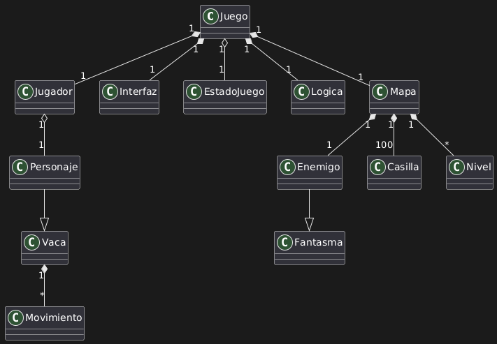

# Cow-Bert
Cow-Bert es un juego basado en el juego arcade "Q-bert", programado en C con ayuda de la bibliotecca SMFL.

## Manual de Usuario
Para jugar es muy sencillo, utiliza las teclas WASD para moverte por el mapa, ¡PERO CUIDADO!, si te sales perderás una vida y tu progreso en el nivel.
Intenta pasar por todas las casillas evitando a nuestro enemigo, el fantasma, si lo tocas perderás una vida.

Oh no, parece que te has quedado sin vidas, no te preocupes, presiona la tecla R y podrás jugar de nuevo!!

## Manual de Programador
Para compilar y ejecutar el juego es muy sencillo, solo basta con una linea de codigo en la terminal.
'make runmain'
Esta linea de codigo primeramente creará el archivo .exe del programa y posteriormente lo ejecutará.

## Diagrama de clases

